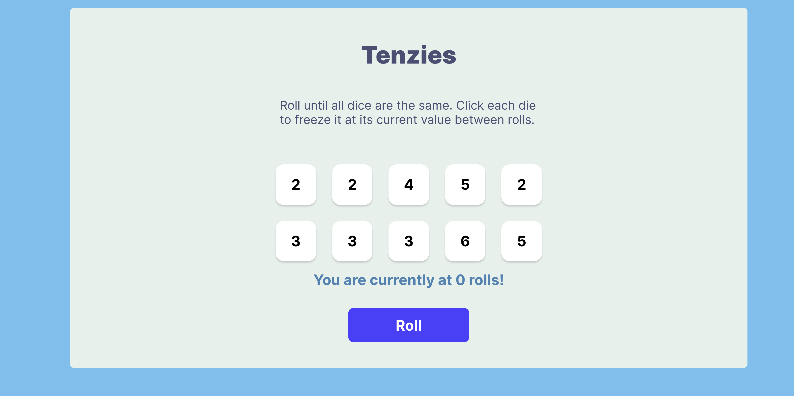

[](https://app.netlify.com/sites/tenzies-with-react/deploys)


# Tenzies Game with Reactjs

This is a React game app called Tenzies. It is a game where you can play with your friends.Roll until all dice are the same. Click each die to freeze it at its
current value between rolls.

## Table of contents

- [Overview](#overview)
  - [The challenge](#the-challenge)
  - [Screenshot](#screenshot)
  - [Links](#links)
- [My process](#my-process)
  - [Built with](#built-with)
  - [What I learned](#what-i-learned)
- [Author](#author)

## Overview

### The challenge

Users should be able to:

- View the optimal layout for the site depending on their device's screen size
- See hover states for all interactive elements on the page
- See the game play in action
- click and roll the dice
- click and hold the dice
- freeze the dice
- see the total number of rolls



### Links

- Live Site URL: [https://tenzies-with-react.netlify.app/](https://tenzies-with-react.netlify.app/)

## My process

### Built with

- Semantic HTML5 markup
- CSS custom properties
- Flexbox
- CSS Grid
- Mobile-first workflow
- Javascript
- Reactjs
- nanoid
- Netlify
- Confetti


### What I learned


- React State

State is a plain JavaScript object used by React to represent an information about the component's current situation. It's managed in the component.

- UseEffect Hook

The useEffect Hook allows you to perform side effects in your components. Some examples of side effects are: fetching data, directly updating the DOM, and timers. useEffect accepts two arguments. The second argument is optional. useEffect(<function>, <dependency>)

- What is a useEffect cleanup function?

What is the useEffect cleanup function? Just like the name implies, the useEffect cleanup is a function in the useEffect Hook that allows us to tidy up our code before our component unmounts. When our code runs and reruns for every render, useEffect also cleans up after itself using the cleanup function

- The preventDefault() method cancels the event if it is cancelable, meaning that the default action that belongs to the event will not occur.

- React Events
- React Forms - I will create a seperate post for this
- nanoid is used to distinguish each dice
- Confetti is used to show the winner

```js
// Select a random image from the API and save it into the state
  function generateNewDie() {
    return {
      value: Math.ceil(Math.random() * 6),
      isHeld: false,
      // nanoid is a random string generator used as id number generator for each die
      id: nanoid(),
    };
  }
```

## Author

- Website - [scriptsandtags.com](https://www.scriptsandtags.com/)
- Frontend Mentor - [@whoiskekeanyway](https://www.frontendmentor.io/profile/whoiskekeanyway)
- Twitter - [@scriptsandtags](https://www.twitter.com/scriptsandtags)
# tenzies-with-react
